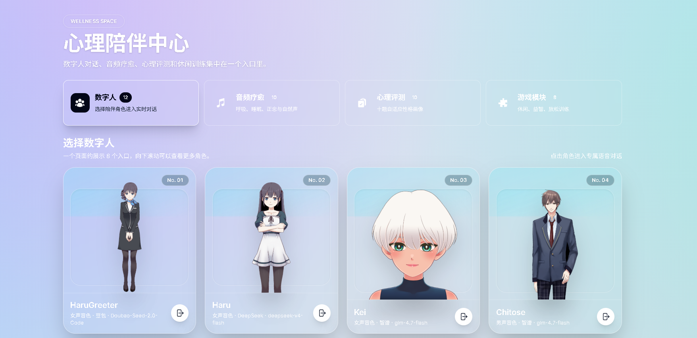
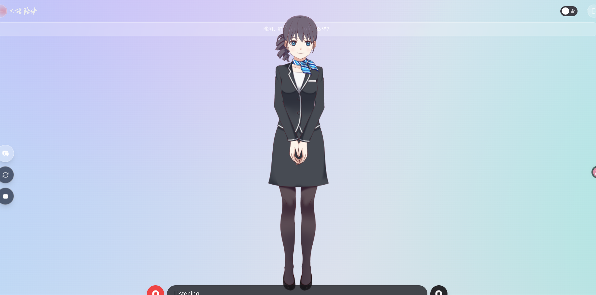
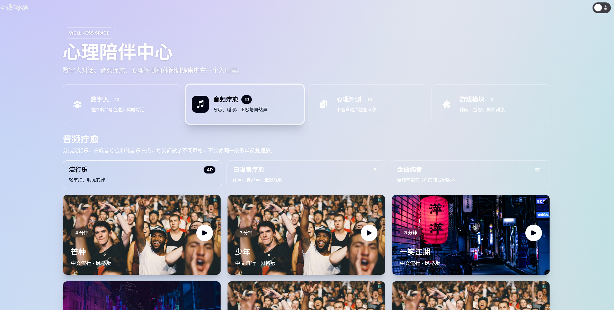
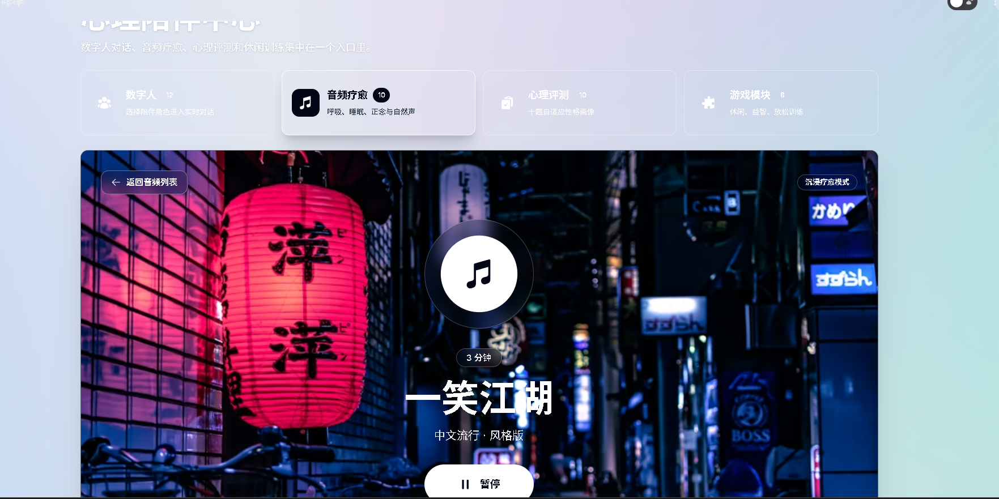
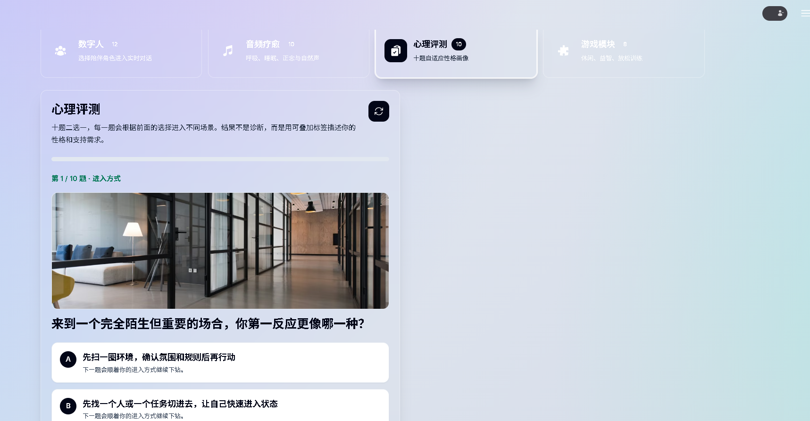
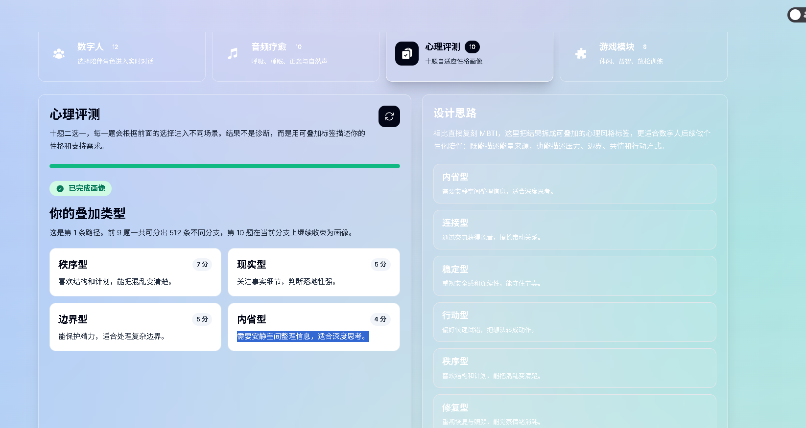

# Digital Human Cartoon

2D Live2D digital human assistant with a web front end, Python backend, realtime voice chat, TTS playback, user management, and crisis alert workflows.

## Features

- Live2D character gallery and large character entry page after login.
- Hands-free realtime voice chat using browser speech recognition when available.
- Text chat, speech synthesis, opening greeting, and restart conversation flow.
- Crisis keyword monitoring for self-harm and violence-to-others risk phrases.
- Guardian/admin notification pages for high-risk conversation alerts.
- Long-term memory with Milvus first and local JSONL fallback for user facts.
- Wellness modules for audio healing, adaptive psychological assessment, and casual games.
- Configurable LLM, ASR, and TTS engines.

## Product Preview

### Wellness Space Home

The main entry page brings the four core modules into one wellness space: digital humans, audio healing, psychological assessment, and casual games. The digital human cards show the character avatar, voice style, and assigned model so users can choose a companion before entering realtime chat.



### Realtime Digital Human Chat

The realtime chat scene centers the Live2D character, keeps the conversation controls lightweight, and supports spoken interaction, TTS playback, conversation restart, and manual interruption. It is designed as a voice-first digital human experience instead of a traditional text-only chatbot.



### Audio Healing Library

The audio healing module groups music into pop, white noise healing, and instrumental categories. Each track uses a visual cover, duration badge, and play action so users can browse quickly and enter a more immersive listening mode.



### Immersive Audio Player

Clicking a track opens an immersive playback scene with a large background cover, central play state, track metadata, and a return action. This mode keeps the interface calm and focused for breathing, rest, sleep, or relaxation sessions.



### Adaptive Psychological Assessment

The psychological assessment module uses a branching ten-question flow. Each answer guides the next question, and the final result is expressed as stackable personality/support labels instead of a single rigid diagnosis.



### Game Training Hub

The game module collects casual and cognitive training games such as 2048, tower-style reasoning, memory matching, breathing rhythm training, color connection, and strategy puzzles. A side panel previews the selected game before entering the full experience.



### 2048 Game Experience

The 2048 game runs inside an immersive detail view with a blurred themed background, clear rules, score display, board state, and directional controls for touch devices.


## Project Structure

```text
digital_human_cartoon/
  configs/        Engine and agent configuration files
  digitalHuman/   Python backend, agents, TTS/ASR engines, memory, alerts
  docs/           Deployment notes and voice troubleshooting history
  web/            Next.js frontend and Live2D assets
```

## Configuration

Do not commit real credentials. Copy `.env.example` to `.env` on the target server and fill in deployment-specific values.

Important environment variables:

- `DHC_DB_HOST`, `DHC_DB_PORT`, `DHC_DB_USER`, `DHC_DB_PASSWORD`, `DHC_DB_NAME`
- `DHC_DOUBAO_BASE_URL`, `DHC_DOUBAO_API_KEY`, `DHC_DOUBAO_MODEL`
- `DHC_ZHIPU_BASE_URL`, `DHC_ZHIPU_API_KEY`, `DHC_ZHIPU_MODEL`
- `DHC_LONGCAT_BASE_URL`, `DHC_LONGCAT_API_KEY`, `DHC_LONGCAT_MODEL` are accepted only as legacy fallbacks.
- `DHC_MILVUS_HOST`, `DHC_MILVUS_PORT`, `DHC_MILVUS_USER`, `DHC_MILVUS_PASSWORD`
- `DHC_JWT_SECRET`

## Deployment Notes

The production/test deployment is expected to run on Linux with HTTPS enabled for browser microphone permissions. See:

- `docs/FunASR_Streaming_Deploy_Guide.md`
- `docs/语音问题排查与修改记录.md`

## Security

This repo should contain source code, public Live2D assets, and sanitized examples only. Rotate any credential that was ever committed before this cleanup, because deleting it in a later commit does not remove it from Git history.

